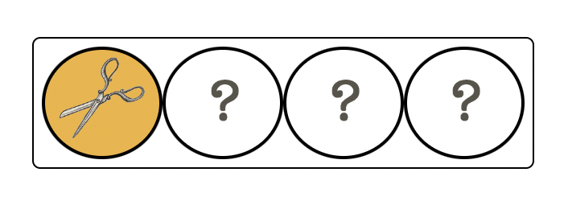
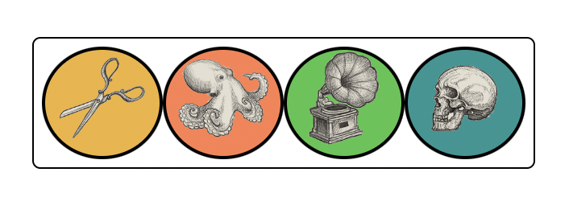

# &lt;emmbryo-item-row&gt;
This component represents a row with four elements and is used for two purposes in the master mind game:
- the "master row", that holds the answer of the current game
- each row that the player uses when playing the game

## Attributes

### `image`
This attribute sets the next image in the row. It can only be used to set one image at a time. The previous set images are saved in an array and when the image attributes changes, the new image is added to the array and then the row s updated with the new array.
The image-ids to choose from:
- squid
- grammophone
- cup
- scissors
- man
- skull

When inserting the element to the DOM via html, only the first item in the row can be filled (see example 1). To whole row can only be filled dynamically by using javascript (see example 2).

### `clear`
When this attribute is added to the row, all contents of the row is deleted and the player can restart filling the row.

### `play`
When the play attribute is added, it signals that the player plays the row. The value of this attribute represents the master row (the answer to the current game), that the played row is to be compared to.

## Events

| Event Name | Fired When           | Info |
| ---------- | -------------------- | ---- |
| `result` | The row is played | This event holds the result of the played row, it signals if any item(s) were completely correct and/or if item(s) were present but in the wrong place.
| `freeze` | The row is played | Signals that the row is no longer available in the game.

## Styling with CSS

lite tips

## Example 1

```html
<emmbryo-item-row image="scissors">
</emmbryo-item-row>
```



## Example 2
Fill the whole row dynamically. One example is that when you click on the element, the row is filled:
```js
const items = ['scissors', 'squid', 'grammophone', 'skull']
const row = document.createElement('emmbryo-item-row')

row.addEventListener('click', event => {
  for (let i = 0; i < items.length; i++) {
    row.setAttribute('image', items[i])
  }
)}
```
