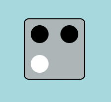

# &lt;emmbryo-status-square&gt;

This is a component that represents the status square in a master mind game. It shows the player the result of his/her guess. If an item is correctly placed, it shows one black pin, if the item is corrrect but in the wrong place it shows a white pin. If none of these, it shows nothing. It can show up to four pins.

## Attributes

### `config`

Is a string that determines the status of each pin in the square. The pin can either be empty, which is default, or it can be black or white. The black is set by 'correct-place' and white is set by 'correct-color'. 


## Example

```html
<emmbryo-status-square config="correct-place correct-place correct-color">
</emmbryo-status-square>
```

### The above values for config attribute generates the following:
